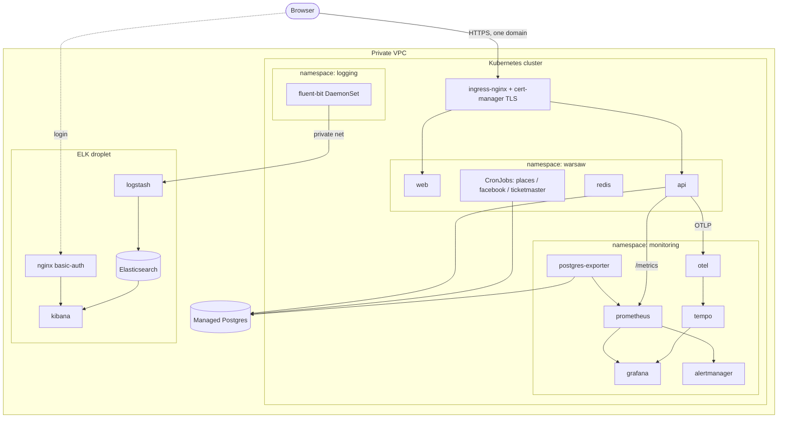

# Cloud deployment (`deploy/cloud`)

Production on **DigitalOcean**: a Kubernetes cluster (DOKS) for the app and
observability, a **managed Postgres**, and a dedicated **ELK droplet** for logs —
all inside one private VPC, provisioned by Terraform, configured by Helm and
Ansible, and shipped by GitHub Actions.

> Local counterpart: [`deploy/local`](../local/README.md). Same three
> observability pillars; here they run as Helm charts + a droplet instead of
> Compose containers.

> **Status:** the environment is currently torn down to stop billing. Everything
> here is declarative — it rebuilds from Terraform + these manifests.

---

## Architecture



---

## Components

| Path | Tool | Provisions |
|------|------|-----------|
| [`terraform/`](terraform) | Terraform | VPC, DOKS cluster, managed Postgres (+db, firewall), ELK droplet, SSH key, firewalls |
| [`k8s/`](k8s) | kubectl | App manifests: namespace, redis, api, PDB, ingress, network policies, cronjobs, web (+ `optional/` in-cluster Postgres, unused with managed DB) |
| [`platform/`](platform) | Helm + kubectl | Cluster add-ons: kube-prometheus-stack (Prometheus/Grafana/Alertmanager), otel-collector, Tempo, postgres-exporter, fluent-bit, cert-manager issuer, CoreDNS rewrite, dashboards + alert rules |
| [`ansible/`](ansible) | Ansible | The ELK droplet: Docker, ES+Logstash+Kibana, nginx basic-auth, ILM retention |

---

## The three pillars (cloud)

- **Metrics** — `kube-prometheus-stack` (Helm) runs Prometheus + Grafana +
  Alertmanager + node-exporter + kube-state-metrics. Scrape targets and app/DB/OTel
  jobs come from [`platform/kube-prometheus-stack-values.yaml`](platform/kube-prometheus-stack-values.yaml);
  alert rules from [`platform/alerting-rules.yaml`](platform/alerting-rules.yaml)
  (a `PrometheusRule` CRD). Grafana is fronted by ingress + TLS; dashboards from
  [`platform/grafana-dashboard.yaml`](platform/grafana-dashboard.yaml) and
  [`grafana-search-analytics.json`](platform/grafana-search-analytics.json).
- **Traces** — the app pushes OTLP to `otel-collector` (Helm), which forwards to
  **Tempo** (Helm); Grafana queries Tempo.
- **Logs** — **fluent-bit** runs as a DaemonSet ([`platform/fluent-bit-values.yaml`](platform/fluent-bit-values.yaml)),
  tails every pod's logs (`/var/log/containers/*.log`), enriches with Kubernetes
  metadata, and ships over the private network to Logstash on the **ELK droplet**
  (ES + Logstash + Kibana behind nginx basic-auth). ILM deletes indices after 30
  days.

Difference vs local: metrics/logs use **service discovery + Helm** instead of a
static `prometheus.yml`, and fluent-bit **tails files** instead of receiving from
the Docker fluentd driver. The `Logstash → ES → Kibana` leg is identical.

---

## Prerequisites

- Tools: `terraform`, `kubectl`, `helm`, `ansible`, `doctl`, `envsubst`, `psql`, `docker`.
- A root `.env` (git-ignored) providing:
  `DIGITALOCEAN_TOKEN`, `TF_VAR_ssh_public_key`, `TF_VAR_admin_ip`,
  `GITHUB_USER`, `GITHUB_TOKEN`, `WARSAW_DOMAIN`, `ACME_EMAIL`,
  `GRAFANA_PASSWORD`, `KIBANA_PASSWORD`, `WARSAW_APP_DB_PASSWORD`, `PG_MONITOR_PASSWORD`.
- A domain whose DNS you can point at the ingress load balancer.

---

## Deploy runbook

Full details: [`docs/hosting-digitalocean.md`](../../docs/hosting-digitalocean.md).

```bash
make keys              # SSH key for the ELK droplet
make do-infra-up       # Terraform: VPC + DOKS + managed Postgres + ELK droplet
make do-kubeconfig     # save the cluster kubeconfig

make do-db-init        # enable pgvector + pg_trgm on the managed DB (once)
make do-db-role        # create the least-privilege app DB role (warsaw_app)
make do-db-monitor-role# create the read-only metrics role (warsaw_monitor)
make do-db-migrate     # create/upgrade the schema as admin

make do-images         # build linux/amd64 images + push to GHCR  (or let CI do it)
make do-platform       # Helm: ingress-nginx, cert-manager (+issuer), monitoring, fluent-bit

# app secret is applied MANUALLY (never in CI):
kubectl apply -f deploy/cloud/k8s/secret.yml   # filled from secret.example.yml

make do-deploy         # apply the app manifests (rolling update)  (or let CI do it)
make do-elk            # provision the ELK droplet (Ansible)
# then point DNS (WARSAW_DOMAIN) at the ingress load balancer

make do-infra-down     # DESTROY everything (stop the bill)
```

---

## CI/CD

[`.github/workflows/deploy.yml`](../../.github/workflows/deploy.yml) runs on push to
`main`:

1. **test** — ruff + pytest (throwaway pgvector service) + frontend build.
2. **build-push** — build API + web images, push to GHCR by commit SHA.
3. **deploy** — targets the `production` GitHub Environment (manual gate),
   `doctl` auth → `kubectl apply` of `deploy/cloud/k8s/*` → waits for rollout.

`deploy` needs the `DIGITALOCEAN_ACCESS_TOKEN` secret and a live cluster; `test`
and `build-push` are self-contained.

---

## Security

- **Managed Postgres**, reached only inside the VPC; app runs as a **least-privilege
  DML-only role** (`warsaw_app`), metrics as a **read-only** role (`warsaw_monitor`).
- **Row-Level Security** on user-owned tables (DB-enforced, under the app checks).
- **TLS** via cert-manager (Let's Encrypt) on the ingress; HTTP-01 solved through a
  CoreDNS rewrite ([`platform/coredns-custom.yaml`](platform/coredns-custom.yaml)).
- **Network policies** ([`k8s/45-networkpolicies.yml`](k8s/45-networkpolicies.yml))
  restrict pod-to-pod traffic.
- **ELK droplet:** ES/Kibana bound to localhost, Logstash to the private IP; public
  Kibana access only through **nginx + basic auth**.
- **Secrets are manual, never in git/CI:** `warsaw-secrets` (app) and
  `postgres-exporter-dsn` (metrics) are `kubectl apply`-ed out of band; only
  `secret.example.yml` is tracked.
- **Alertmanager → Telegram** is wired but dormant (routes to `null`) until
  `TELEGRAM_*` is set.

---

## Retention

- **Logs:** ILM policy deletes `k8s-logs-*` indices after **30 days** (set in the
  Ansible ELK role).
- **Metrics:** Prometheus retains **15 days** on a persistent volume.

---

## Layout

```
deploy/cloud/
  terraform/            # VPC, DOKS, managed Postgres, ELK droplet, firewalls
  k8s/                  # app manifests (namespace, api, web, redis, ingress, cronjobs, …)
    optional/           # in-cluster Postgres (unused with managed DB)
    secret.example.yml  # template for the manually-applied app Secret
  platform/             # Helm values + cluster manifests (monitoring, tracing, logging shipper, TLS)
  ansible/              # ELK droplet role (ES + Logstash + Kibana + nginx + ILM)
```
