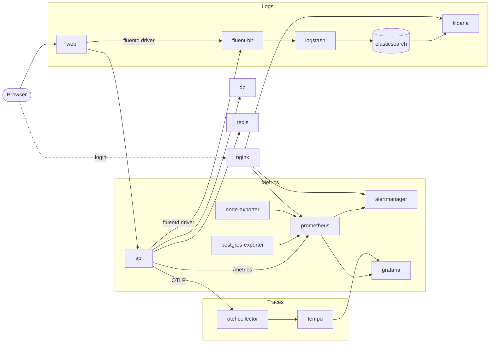

# Local deployment (`deploy/local`)

The whole application **plus the same observability the cloud runs** — metrics,
logs, and traces — on one machine, with a single command. It exists so the
DevOps modules (ELK, Prometheus/Grafana) can be demonstrated on a laptop while
the DigitalOcean environment stays torn down.

> Cloud counterpart: [`deploy/cloud`](../cloud/README.md). The stacks are
> deliberately equivalent; only the delivery mechanism differs (Docker Compose
> here, Kubernetes/Helm/Ansible there).

---

## What runs

Everything is a container in one Compose project (`warsaw-stack`), on one private
Docker network. Each row is a separate container.

| Group | Service | Purpose | Exposed on host |
|-------|---------|---------|-----------------|
| **App** | `web` | Next.js frontend | http://localhost:3000 |
| | `api` | FastAPI backend (`/metrics`, `/health`) | http://localhost:8000 |
| | `db` | Postgres + pgvector | `localhost:5432` |
| | `redis` | cache / rate-limit | `localhost:6379` |
| **Metrics** | `prometheus` | scrapes & stores metrics (TSDB) | via nginx → :9090 🔒 |
| | `alertmanager` | routes fired alerts | via nginx → :9093 🔒 |
| | `grafana` | dashboards, Explore, traces | http://localhost:3001 🔒 |
| | `postgres-exporter` | Postgres metrics (`pg_*`) | internal only |
| | `node-exporter` | host VM metrics (`node_*`) | internal only |
| **Traces** | `otel-collector` | receives OTLP spans, fans out | internal only |
| | `tempo` | trace store | internal only |
| **Logs** | `fluent-bit` | log shipper (Docker fluentd driver) | `:24224` (intake) |
| | `logstash` | log pipeline → Elasticsearch | internal only |
| | `elasticsearch` | log store / search | internal only |
| | `kibana` | log UI | via nginx → :5601 🔒 |
| **Gateway** | `nginx` | basic-auth in front of the infra UIs | :5601 / :9090 / :9093 |
| **Scheduler** | `ofelia` | periodic ingestion (opt-in) | — |

🔒 = requires the login set by `make infra-auth`.

---

## Architecture



**Two rules that explain the whole design:**
1. **Pull vs push.** Prometheus *pulls* metrics (scrapes `/metrics`). Traces are
   *pushed* (app → collector → Tempo). Logs are *pushed* (driver → Fluent Bit →
   Logstash → ES).
2. **Grafana/Kibana only read.** They never receive telemetry — they query the
   stores (Prometheus / Tempo / Elasticsearch) on demand.

---

## Prerequisites

- **Docker Engine + Compose v2** (v2.24+). On Debian/Ubuntu install Docker CE
  from the official apt repo (not the `docker.io`/snap package).
- **~4–6 GB RAM** free for the full stack (Elasticsearch is the heavy part).
- **Linux only:** set the Elasticsearch kernel requirement once —
  ```bash
  sudo sysctl -w vm.max_map_count=262144
  echo 'vm.max_map_count=262144' | sudo tee /etc/sysctl.d/99-elasticsearch.conf
  ```
  (Docker Desktop on macOS sets this inside its VM automatically.)
- **`backend/.env`** for the API to actually serve — `cp backend/.env.example
  backend/.env` and fill keys. The observability services start without it; demo
  data seeds without any keys.

---

## Quick start

```bash
# 1. set ONE login/password for all infra UIs (Grafana + Kibana/Prometheus/Alertmanager)
make infra-auth AUTH_USER=admin AUTH_PASS=<password>

# 2. first run: build, start everything, load 100 [TEST] demo events + test users
make stack-init

# open http://localhost:3000  · Grafana http://localhost:3001 (your login)
```

Already initialized? `make stack-up`. Stop with `make stack-down` (data kept).

### Make commands

| Command | What it does |
|---------|--------------|
| `make infra-auth AUTH_USER=.. AUTH_PASS=..` | set the infra login (writes gitignored `.htpasswd` + `secrets.env`) — run once |
| `make stack-init` | first run: start stack + wait for API + load demo events + test users |
| `make stack-up` | build + start the whole stack |
| `make stack-down` | stop everything (named volumes kept) |
| `make stack-logs` | follow all logs |
| `make seed-fixtures` | load the 100 `[TEST]` demo events (no API keys) |
| `make seed-users` | create test users `user1@test.com` / `user2@test.com` (pw `1234`) |
| `make stack-seed` | demo fixtures + real sources (`places`, `facebook_events`) |
| `make scheduler-up` / `scheduler-down` | enable/disable periodic ingestion (ofelia) |

---

## The three pillars

### Metrics — Prometheus + Grafana
Prometheus scrapes `api:8000/metrics`, `postgres-exporter:9187`,
`node-exporter:9100`, `otel-collector:8889` and itself, stores 7 days of
time-series, and evaluates alert rules. Grafana reads Prometheus.
- Config: [`config/prometheus.yml`](config/prometheus.yml) (scrape jobs),
  [`config/prometheus-rules.yml`](config/prometheus-rules.yml) (alerts),
  [`config/alertmanager.yml`](config/alertmanager.yml).
- Grafana is auto-provisioned: datasources + dashboards under
  [`config/grafana/`](config/grafana) (*App Overview*, *Search Analytics*,
  *Host / VM*).

### Logs — ELK (Fluent Bit → Logstash → Elasticsearch → Kibana)
`api`/`web` log via the Docker **fluentd** driver → **Fluent Bit** (`forward`
input) → **Logstash** (`tcp json_lines`) → **Elasticsearch** (index
`warsaw-logs-*`) → **Kibana**.
- Config: [`config/fluent-bit/fluent-bit.conf`](config/fluent-bit/fluent-bit.conf),
  [`config/logstash/pipeline/logstash.conf`](config/logstash/pipeline/logstash.conf).
- In Kibana create the index pattern `warsaw-logs-*` (time field `@timestamp`) once.

### Traces — OpenTelemetry → Tempo
The API is instrumented (`app/observability.py`) and pushes OTLP spans to the
**otel-collector**, which forwards them to **Tempo**. View a request's waterfall
in Grafana → Explore → Tempo.
- Config: [`config/otel-collector.yaml`](config/otel-collector.yaml),
  [`config/tempo.yaml`](config/tempo.yaml).

---

## Security model

Auth is applied to **external** access only; internal container-to-container
traffic stays on the trusted Docker network.

- **`nginx` auth gateway** — basic-auth (from `.htpasswd`) in front of Kibana,
  Prometheus, Alertmanager. Their raw ports are not published; nginx is the only
  way in. Mirrors the cloud nginx that fronts Kibana. Config:
  [`nginx/nginx.conf`](nginx/nginx.conf).
- **Grafana** — its own login, password from `secrets.env`.
- **Not exposed at all** — Elasticsearch, Tempo, node/postgres-exporter,
  otel-collector: internal only, nothing to attack.
- **Secrets** — `.htpasswd` and `secrets.env` are generated by `make infra-auth`
  and git-ignored. `stack-up` refuses to start until they exist.

---

## Scheduled ingestion (ofelia)

Local mirror of the cloud Kubernetes CronJobs. The `ofelia` scheduler reads
`ofelia.*` labels on the `api` service and runs the ingestion runner inside it on
a schedule (`places` Mon 04:00, `facebook_events` every 6h, `ticketmaster` every
12h). **Opt-in** (compose profile) so a plain `stack-up` never quietly calls
external APIs:

```bash
make scheduler-up      # enable ;  make scheduler-down to stop
```
Change a schedule in the `ofelia.job-exec.*.schedule` labels (6-field cron or
`@every 2m`), then `docker compose … up -d api && make scheduler-down && make scheduler-up`.

To ingest **now** (no waiting), just run the runner directly:
`docker compose -f deploy/local/docker-compose.yml exec api python -m app.ingestion.runner --source=places`.

---

## Data & persistence

Named volumes survive `stack-down` (only `down -v` wipes them):
`pgdata` (DB), `prometheus-data`, `grafana-data`, `tempo-data`, `es-data`.
So seeding is a one-time step.

---

## Troubleshooting

| Symptom | Fix |
|---------|-----|
| `stack-up` refuses to start | run `make infra-auth …` first |
| Elasticsearch won't start (Linux) | `vm.max_map_count=262144` (see prerequisites) |
| Kibana empty | create index pattern `warsaw-logs-*`; generate traffic; check `logs fluent-bit logstash` |
| Grafana panel empty | widen the time range; make sure you generated activity |
| 502 through nginx | upstream still starting — wait a few seconds |
| Search returns nothing | set `VOYAGE_API_KEY` in `backend/.env`, then re-seed |

Verify from inside (services aren't published):
```bash
docker compose -f deploy/local/docker-compose.yml exec elasticsearch curl -s localhost:9200/_cat/indices?v
docker compose -f deploy/local/docker-compose.yml ps
```

---

## Layout

```
deploy/local/
  docker-compose.yml        # the whole stack
  nginx/nginx.conf          # auth gateway (basic-auth reverse proxy)
  config/
    prometheus.yml          # scrape jobs
    prometheus-rules.yml    # alert rules
    alertmanager.yml        # alert routing (null receiver locally)
    otel-collector.yaml     # OTLP → Tempo + Prometheus exporter
    tempo.yaml              # trace store
    fluent-bit/…            # log shipper
    logstash/pipeline/…     # log pipeline → Elasticsearch
    grafana/…              # provisioned datasources + dashboards
  .htpasswd, secrets.env    # generated by make infra-auth (git-ignored)
```
